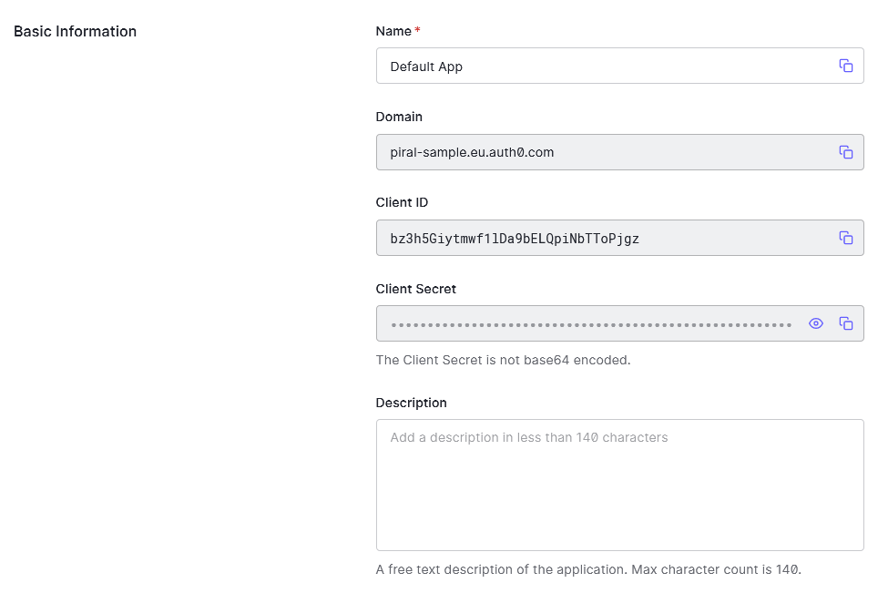
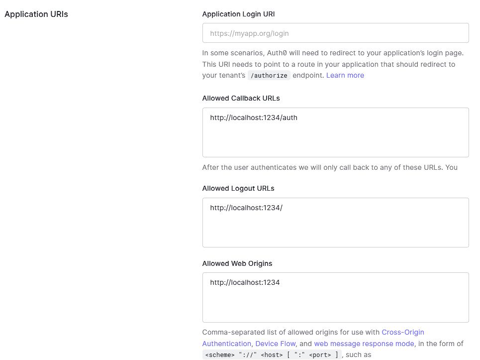

[](https://piral.io)

# [Piral Sample](https://piral.io) &middot; [](https://github.com/smapiot/piral/blob/main/LICENSE) [](https://gitter.im/piral-io/community)

> Sample app shell to leverage auth0 as authentication provider.

:zap: This sample demonstrates using `piral-oidc` to connect to an available auth0 identity provider.

You can visit this demo at [auth0.samples.piral.cloud/](https://auth0.samples.piral.cloud/).

## Getting Started

Install the dependencies:

```sh
npm install
```

If you want to change the values to your auth0 provider then go ahead and modify the values in the *src/client.ts* module. These values need to come from auth0 as shown in the next section.

Now run:

```sh
npm start
```

The app shell should be up and running.

For the sample you can log in with the following sample credentials:

- Username is `foo@bar.com`
- Password is `foobar` followed by `123` and `!`

**Note**: Due to the auth0 configuration only port `1234` is working (only accepting http://localhost:1234 requests).

## Auth0 Setup

The whole configuration can be found at [OIDC config](https://piral-sample.eu.auth0.com/.well-known/openid-configuration).

Not much has changed there from the default options. The only things that are necessary are the client details that can be found in the application settings:



The allowed login / logout and request URLs need to be configured:



Make sure to also include URLs of your other environments if applicable.

## More Information

You find more information at the the [oidc plugin page](https://docs.piral.io/plugins/piral-oidc).

Most issues will actually be solved by getting familiar with the library (`oidc-client`) underneath. See [oidc-client](https://www.npmjs.com/package/oidc-client).

## License

Piral and this sample code is released using the MIT license. For more information see the [license file](./LICENSE).
